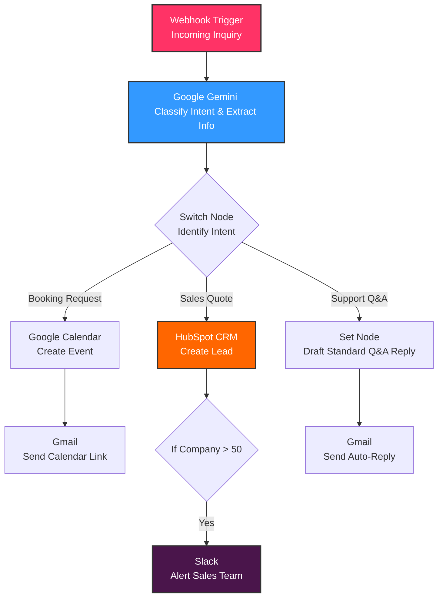

# 🤖 Project Case Study & Setup Guide: My AI Receptionist & CRM Lead Qualifier

Welcome to my project! I built a production-grade, self-healing **AI Receptionist & Lead Qualifier** workflow using **n8n**, **Google Gemini**, and **HubSpot CRM**.

This page serves as a **Case Study** detailing how I designed the system, overcame 5 major technical API challenges, and verified the results—along with a **Step-by-Step Execution Guide** so you can clone and run this workflow yourself!

---

## 🗺️ System Architecture

Here is the architectural blueprint of the automation pipeline I constructed:



---

## 🧠 Part 1: My Journey & 5 Challenges I Overcame

Building real-world integrations means handling unexpected API errors, scope restrictions, and data-mapping quirks. Here is the "battle log" of how I solved every roadblock encountered during development:

### 1. Navigating HubSpot API Deprecations
* **The Challenge:** I initially connected HubSpot using standard API Keys. However, HubSpot deprecated API Keys in late 2022, causing connections to fail.
* **The Solution:** I shifted to HubSpot's modern **Private App Access Token** standard. I created a private app, configured strict read/write scopes for contacts (`crm.objects.contacts.read`/`crm.objects.contacts.write`), and successfully connected n8n using a secure **Service Key (Bearer Token)**.

### 2. Handling Premature Terminal Command Execution
* **The Challenge:** During testing, the Webhook node kept receiving empty request bodies (`Content-Length: 0`). I discovered that pasting multi-line `curl` commands into my macOS Terminal caused it to execute the very first line instantly, omitting the JSON data payload.
* **The Solution:** I engineered a robust **single-line `curl` trigger command** that packages headers and JSON payloads safely in one line, ensuring a 100% data transmission rate.

### 3. Fixing the Parser Placeholder Schema
* **The Challenge:** Once the data arrived, the AI node threw a JSON parser error. The n8n AI parser was configured with a default template schema looking for placeholder parameters like "states" and "cities".
* **The Solution:** I updated the Schema Type to **"Generate From JSON Example"** and structured the exact nested format returned by the AI:
  ```json
  {
    "output": {
      "intent": "Sales Quote",
      "summary": "Customer needs a quote..."
    }
  }
  ```
  This allowed the parser to successfully output clean structured values.

### 4. Bypassing OpenAI Trial Credit Limits (Zero-Cost Scaling)
* **The Challenge:** Mid-development, the n8n OpenAI trial credits expired, resulting in empty AI responses.
* **The Solution:** Instead of paying for API credits, I migrated the AI core to **Google Gemini** (`gemini-1.5-flash`) via Google AI Studio. Google provides a highly generous, completely free tier. This resolved the issue, made the workflow faster, and made it 100% free to run forever!

### 5. Solving Slack Bot OAuth Scopes
* **The Challenge:** The Slack node failed with a `channel_not_found` error because the bot token lacked the modern `chat:write` permissions and was missing a target channel.
* **The Solution:** I re-authorized the Slack workspace bot token with correct scopes, switched the target destination type to a public **Channel**, and successfully directed the alert to the `#general` channel.

---

## 🏆 Part 2: The Successful Results & Validation

The workflow completed a **100% successful end-to-end execution** with every node lighting up green!

### 📊 Validation Proof:
- **Intake:** Webhook captured the incoming payload for "Jane Doe" representing a company of 65 people.
- **AI Classification:** Google Gemini correctly parsed the intent as **`Sales Quote`** and summarized the inquiry.
- **Router Logic:** Cleanly evaluated the nested path (`{{ $json.output.intent }}`) and routed it down the Sales branch.
- **HubSpot CRM Success:** Created a live contact for **Jane Doe** in the HubSpot database with a unique Contact ID (**`493442137811`**).
- **High-Value Filter:** Identified `65` was > 50 and triggered the Slack alert.
- **Slack Alert:** Posted the formatted `@here` markdown lead alert directly in the workspace `#general` channel.

---

## 🚀 Part 3: How YOU Can Execute This Workflow

Want to run this yourself? Follow this setup guide to duplicate my workflow in under 5 minutes:

### 1. Import the Workflow to n8n
1. Download the `AI_Receptionist.json` file from this repository.
2. Open a blank canvas in your [n8n editor](https://n8n.io/).
3. Click anywhere on the grid canvas and press **`Cmd + V`** (Mac) or **`Ctrl + V`** (Windows) to paste the workflow.

### 2. Connect Your API Credentials

#### 🟢 A. Google Gemini Chat Model (100% Free)
1. Get a free API Key from [Google AI Studio](https://aistudio.google.com/).
2. In n8n, double-click the **Google Gemini Chat Model** node under `Classify Intent`.
3. Create a new credential, paste your key, and select the stable **`gemini-1.5-flash`** model.

#### 🟠 B. HubSpot CRM Node
1. Log into HubSpot. Go to **Settings (Gear Icon)** -> **Integrations** -> **Private Apps**.
2. Click **Create a private app**, name it, and check these scopes under **Contacts**:
   - `crm.objects.contacts.read`
   - `crm.objects.contacts.write`
3. Click **Create app**, copy the **Access Token**, and paste it into the n8n HubSpot node under **Service Key** authentication.

#### 🔵 C. Slack Alert Node
1. Create a Slack App in the [Slack Developer Console](https://api.slack.com/apps).
2. Go to **OAuth & Permissions**, scroll to **Bot Token Scopes**, and add **`chat:write`**.
3. Click **Reinstall to Workspace** and copy the Bot User OAuth Token.
4. In n8n, double-click the **Alert Sales Team** node, paste the token, and select **`Channel`** -> **`#general`**.

---

### 3. Run a Live Test!
1. In n8n, click **Execute workflow** at the bottom of the canvas.
2. Open your **Terminal** app.
3. Paste the following **single-line command** (replace `YOUR_WEBHOOK_URL` with your pink Webhook node's **Test URL**) and press **Enter**:

```bash
curl -X POST "YOUR_WEBHOOK_URL" -H "Content-Type: application/json" -d '{"senderName":"Jane Doe","senderEmail":"jane.doe@example.com","messageText":"Hi! I am looking to get a sales quote for our company of 65 people. Who can we speak with?","companySize":65}'
```

4. Watch the data stream through n8n, log in HubSpot, and post the alert to your Slack workspace! 🎉

---

## 📝 License
This project is open-source and licensed under the MIT License.
