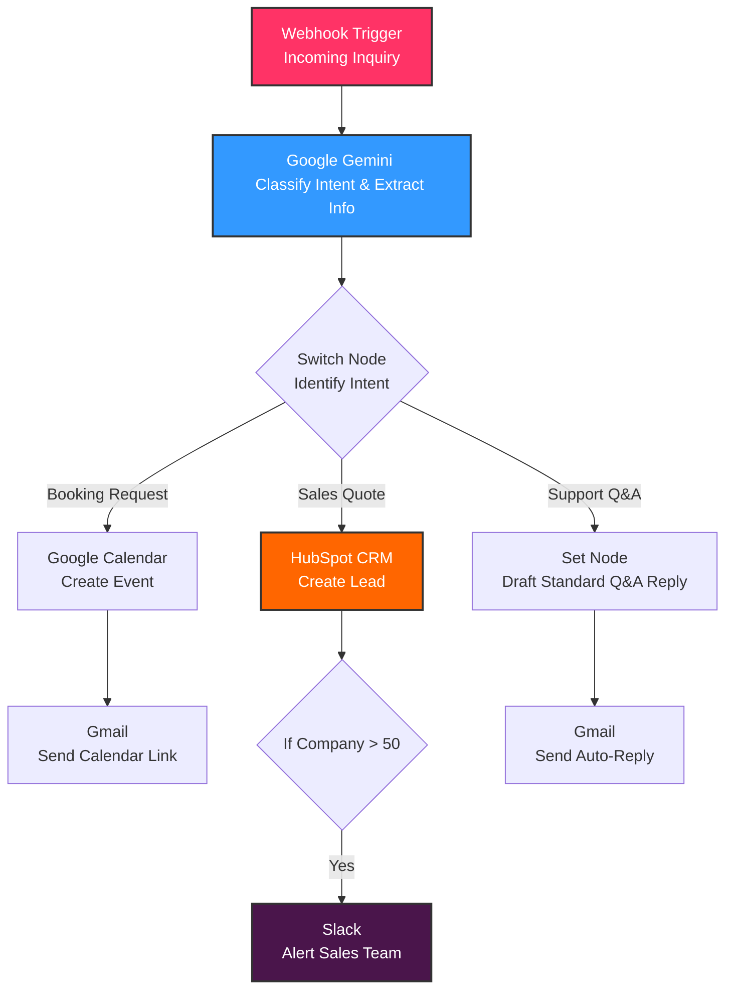

# AI Receptionist & CRM Lead Qualifier (n8n + Gemini + HubSpot)

An automated front-desk assistant that intercepts incoming customer inquiries, uses **Google Gemini** to analyze intent, dynamically routes requests, logs qualified leads directly into **HubSpot CRM**, and sends real-time Slack alerts to the sales team.

---

## System Architecture

The following flowchart illustrates how customer inquiries are routed, parsed by AI, and processed across external services:



---

## Features

- **Real-Time Intake:** Listens 24/7 for customer messages using an HTTP Webhook trigger.
- **Cognitive AI Core:** Utilizes the Google Gemini `gemini-1.5-flash` model to analyze inquiry text, classify intent, and draft professional summaries.
- **Dynamic Routing:** Processes and directs leads along custom execution paths using conditional logic (Booking vs. Sales vs. Q&A).
- **Automated CRM Logging:** Automatically creates contacts in HubSpot with dynamically parsed details (First Name, Last Name, Email, and Company Size).
- **High-Value Lead Filtering:** Scans metadata (e.g., Company Size > 50) and escalates large accounts instantly.
- **Instant Notifications:** Posts structured markdown alerts directly into your team's Slack channel.

---

## 🛠️ Step-by-Step Setup Guide

Follow these steps to set up your repository and connect your workflow.

### 1. Create Your GitHub Repository
Before copying the project, let's create a beautiful home for it on GitHub:

1. Log into your [GitHub account](https://github.com/).
2. Click **New** in the top-left to create a new repository.
3. Fill in the following details:
   - **Repository Name:** `ai-receptionist-n8n`
   - **Description:** `Automated AI receptionist that qualifies leads, creates HubSpot CRM contacts, and triggers Slack alerts based on Gemini's sentiment analysis.`
   - **Visibility:** `Public` (or Private if you prefer).
   - **Initialize this repository with:** Check the **Add a README.md file** box.
4. Click **Create repository** at the bottom.
5. In your new repository page, click **Add file** -> **Upload files**, and drag in the exported `AI_Receptionist.json` file. Click **Commit changes** to save it!

---

### 2. Import into n8n
1. Download the `AI_Receptionist.json` file from your GitHub repository.
2. Open a blank canvas in your [n8n editor](https://n8n.io/).
3. Click anywhere on the grid canvas and press **`Cmd + V`** (Mac) or **`Ctrl + V`** (Windows) to paste the workflow. 
4. The entire diagram will instantly generate in front of you!

---

### 3. Connect the API Credentials

To activate the nodes, you must hook up the credentials for each service:

#### 🟢 A. Google Gemini Setup (100% Free)
1. Go to [Google AI Studio](https://aistudio.google.com/) and click **Get API Key**.
2. Click **Create API Key** and copy the generated token.
3. In n8n, double-click the **Google Gemini Chat Model** node under `Classify Intent`.
4. Create a new credential, paste your API key, and select the stable **`gemini-1.5-flash`** model.

#### 🟠 B. HubSpot CRM Setup (Private App Token)
1. Log into your [HubSpot CRM account](https://www.hubspot.com/).
2. Click the **Gear Icon (Settings)** in the top right, then go to **Integrations** -> **Private Apps** in the left sidebar.
3. Click **Create a private app**, name it `n8n AI Receptionist`, and go to the **Scopes** tab.
4. Search for `contacts` and check:
   - `crm.objects.contacts.read`
   - `crm.objects.contacts.write`
5. Click **Create app**, copy the **Access Token**, and paste it into n8n under the **Service Key** credential settings of your HubSpot node.

#### 🔵 C. Slack Alert Setup (Bot OAuth Scope)
1. In your Slack Workspace, create a new Slack App in the [Slack Developer Console](https://api.slack.com/apps).
2. Go to **OAuth & Permissions**, scroll down to **Bot Token Scopes**, and add the **`chat:write`** scope.
3. Click **Reinstall to Workspace** at the top of the page.
4. Copy the Bot User OAuth Token.
5. In n8n, double-click the **Alert Sales Team** node, create a new credential, paste the token, and select **`Channel`** -> **`#general`** as the destination.

---

## 🧪 Testing the Workflow

Once all nodes show active credentials, you can simulate an incoming inquiry to test the pipeline:

1. In n8n, click the orange **Execute workflow** button at the bottom of the screen.
2. Open the **Terminal** app on your Mac.
3. Copy and paste this single-line command (replace `YOUR_WEBHOOK_URL` with your pink Webhook node's **Test URL**):

```bash
curl -X POST "YOUR_WEBHOOK_URL" -H "Content-Type: application/json" -d '{"senderName":"Jane Doe","senderEmail":"jane.doe@example.com","messageText":"Hi! I am looking to get a sales quote for our company of 65 people. Who can we speak with?","companySize":65}'
```

4. Hit **Enter** in Terminal and watch n8n process the data, log the lead in HubSpot, and trigger your Slack alert in real-time!

---

## 📝 License
This project is licensed under the MIT License - see the LICENSE file for details.
